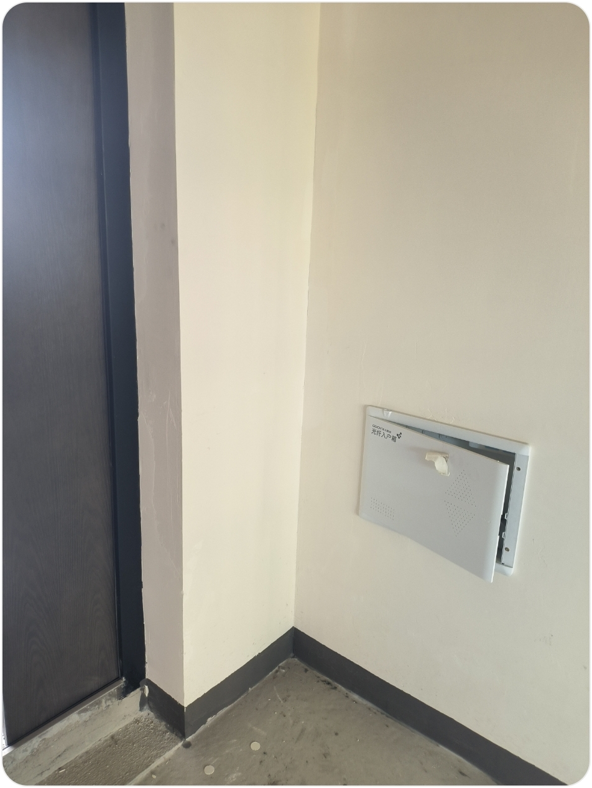
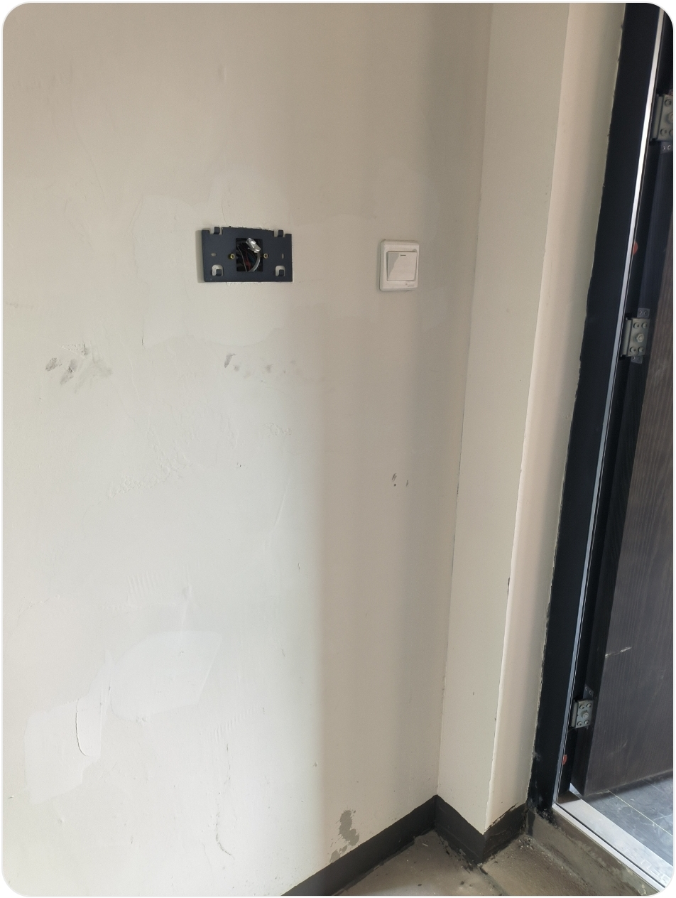
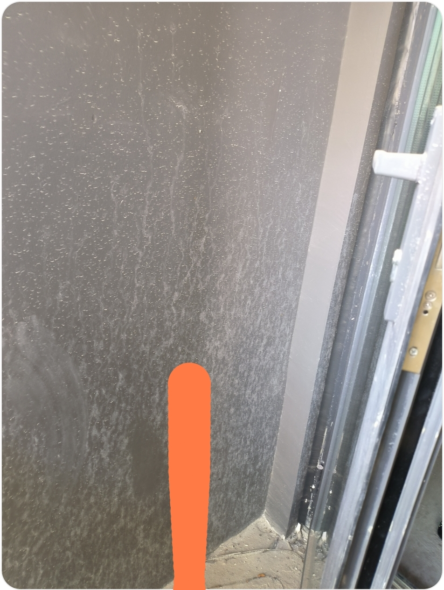
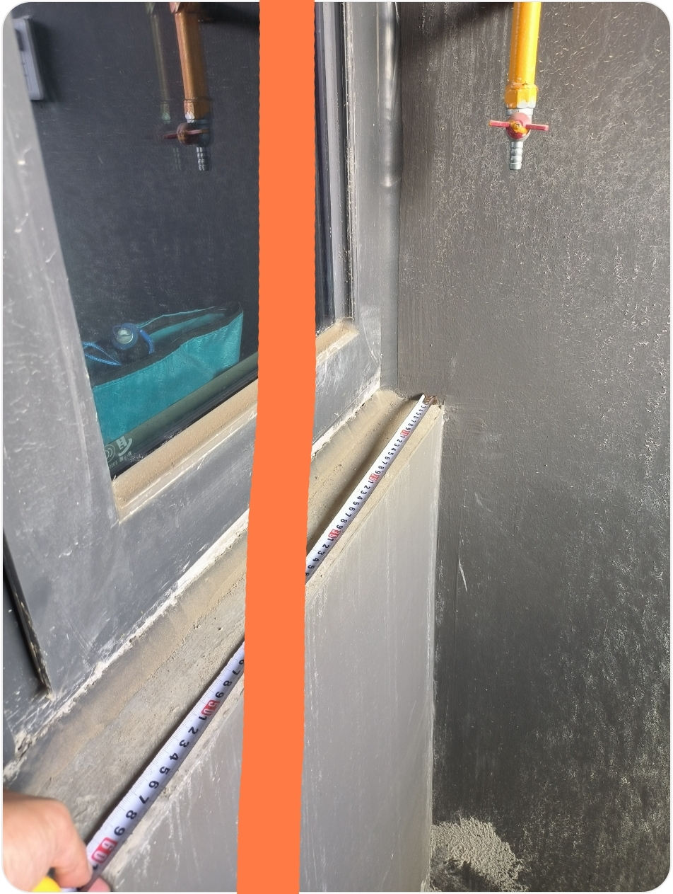
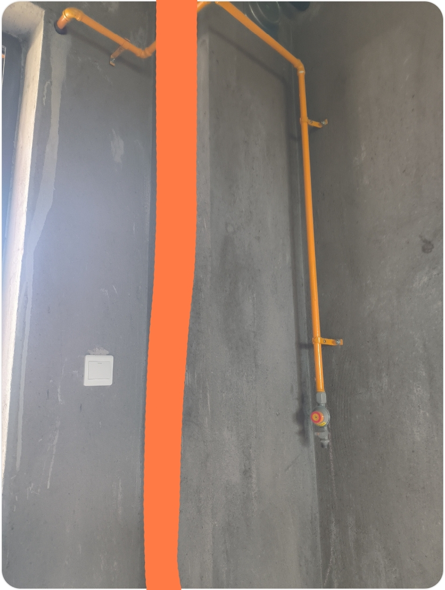
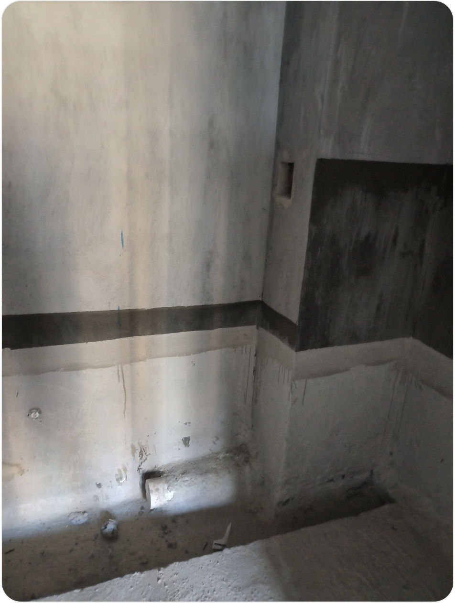

- [ ] 图中入户开门方向反了

- [ ] 大门宽度1161

- [ ] 光纤箱在鞋柜处，鞋柜深度456

- [ ] 下图深度167

- [ ] 生活阳台门

- [ ] 洗衣机超过750 会挡门

- [ ] 排烟口有拐角

- [ ] 公卫尺寸  门所在墙方向宽1864 纵深1770

- [ ] 主卫 1567 2573 排污管墙面 514 317

> 图片来源：以上 6 张照片按原顺序裁自同名 JPG（`2026-10-1 量房记录.jpg`，原路径为 `01-原始资料/量房/2026-10-1 量房记录.jpg`；原 JPG 当前缺失），以原分辨率裁切并保留已有笔迹；裁图不作为独立原始照片。
