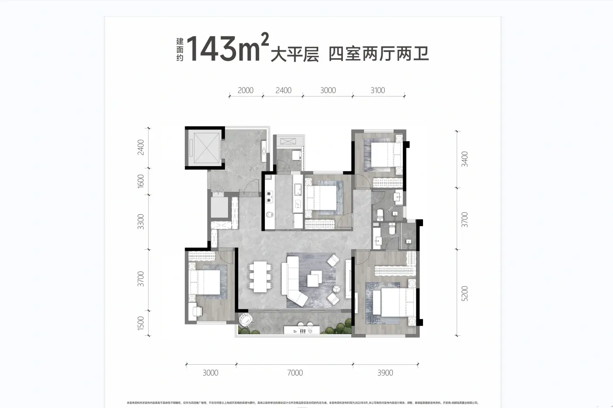

# 承重墙设计约束

更新日期：2026-09-12。用途：后续平面布局、拆改讨论、柜体布置及效果图的共用墙体约束；不是结构鉴定报告或施工拆改图。

## 1. 当前结论与证据状态

**用户于2026-09-12明确确认：`143平户型.webp`中“黑色墙体为承重墙，其余可以拆改”。后续概念设计据此保留黑色墙体，其余墙体可纳入拆改方案比较。**

| 信息 | 依据及状态 | 使用边界 |
|---|---|---|
| 黑色墙体为承重墙 | 2026-09-12用户确认，延续2026-09-06的黑墙保留要求 | 不得拆除、削薄、移位或新增、扩大开口 |
| 其余墙体可以拆改 | 2026-09-12用户本轮明确确认 | 更新原“未标黑墙体不默认可拆”的设计输入；可拆改不等于已决定拆除 |
| 黑色墙段位置、转角和分段关系 | 本次直接目视读取[143平户型.webp](../01-原始资料/户型与CAD/143平户型.webp) | 属于图像判读；下文编号用于定位，不是结构施工图构件编号 |
| 房间编号、方向及实际朝向对应 | [户型对照](户型对照.md)，沿用用户此前确认 | 主卧BR01右下，厨房KIT01左上；图下为北侧、图上为南侧 |
| 房间尺寸及面积 | [房间尺寸与面积-v02](房间尺寸与面积-v02.md)及[当前尺寸底图](../01-原始资料/户型与CAD/143平户型-尺寸面积清晰版.png) | 图上标注或已注明的用户提供值，不是承重墙分段尺寸 |
| 墙厚、端点精确位置、洞口净宽、梁柱关系 | 未取得独立可核验数据 | 待现场测量、结构资料及专业核验；本次不填估算值 |
| DWG及现场结构情况 | 本次未读取DWG，未进行现场查验 | 不声称已完成结构核验；用户确认不替代技术核验 |

## 2. 读图方式与编号规则

直接判读原图：

1. 下文“上、下、左、右”均指这张原图的纸面方向，避免把图片上方误当作北方。固定房间编号不变。
2. 识别对象是墙线上的实心黑色填充，包括短墙垛、转角和向外突出的黑色端部；文字、家具阴影、窗框和尺寸线的黑色不属于墙体分类依据。
3. `CW01—CW10`是按可辨连续关系划分的**10组图示黑色墙段索引**，不是10根独立结构构件，也不是专业结构数量统计；实际构件如何划分待结构图核验。
4. 每组内部按形状拆分描述。黑墙与灰墙相接处记录颜色分界，不把整条共线墙体一律认作承重墙；也不把细小黑色墙垛漏掉。
5. “止于灰色段”“靠近门洞”等属于相对位置描述，不提供毫米级端点。后续设计需要在这些边界布置门框、柜体或拆改收口时，应先核清边界。
6. 当前尺寸清晰版仍是概念方案固定底图；本WEBP用于本次黑墙识别，不替代尺寸基准。两图细部线型、凸出及端点表达不宜视为完全一致，不能未经对照就把一张图的黑墙长度搬到另一张图。

## 3. 黑色承重墙逐组定位

以下均为**原图可辨位置判读，承重属性依据用户确认**。所有墙段的实际长度、厚度、高度及精确坐标均待核，不按图像像素换算。

### CW01：左上公共电梯示意区上侧黑墙组

- **位置**：图最左上方、电梯方框上侧；在ENT01入户区域外侧。
- **形状**：上侧横向黑墙，右端向下形成短竖段；左上角亦有短黑色端部，随后左侧轮廓转为灰色。
- **边界**：右侧向下短段之后有非黑色间隔，不能直接与CW02连成一整条黑色竖墙。
- **约束**：保留图示黑色包角和短端部。该位置用于公共区域边界识别，不将公共电梯区纳入户内扩建或收纳范围。

### CW02：左上公共电梯示意区下侧黑墙组

- **位置**：电梯方框下侧，靠入户外侧通行区域。
- **形状**：下侧横向黑墙，右端向上形成短竖段；左端与电梯左侧灰色轮廓相接。
- **边界**：与CW01之间的电梯左侧、右侧轮廓并非全部填黑，不扩判为完整黑色框体。
- **约束**：横段及右上转角均保留；不借这处黑墙与灰墙的色差推导公共设施可改动范围。

### CW03：KIT01厨房左侧—生活阳台左下侧折墙组

- **位置**：厨房与ENT01一侧通行区域之间，向上连接厨房上方生活阳台左下侧。
- **连续形状，自下向上**：
  1. 厨房左侧长竖向黑墙，下端靠厨房下侧开口左端。
  2. 长竖段上端向图右转为短横向黑墙。
  3. 短横段右端再向图上转为短竖向黑墙，位于生活阳台左下侧。
- **边界**：生活阳台左侧上部在原图中为灰色，不把整条生活阳台左墙都计入本黑墙组。厨房下侧水平边界不因接触黑墙而整段判黑。
- **约束**：保留整组折线及转角，不将厨房左墙整体打通，也不通过削去上部转角扩大厨房或生活阳台门口。厨房下侧、厨房与BR03之间非黑墙部分的拆改，应分别讨论，不能侵入CW03。
- **需要核清**：生活阳台门洞与上部黑色短段的准确相对位置、黑灰交界、转角凸出及墙厚。原图不足以给出门净宽。

### CW04：BR02左侧下段—BR03上侧右端L形黑墙组

- **位置**：右上角卧BR02左侧下部，及中间卧室BR03上侧边界的最右端。
- **连续形状**：BR02左侧竖向黑段向下到转角，再向图左形成短横向黑段，落在BR03上侧右端。
- **边界**：BR02左侧最上端为灰色；BR03上侧中部可见窗线，左侧亦有非黑色部分，不能把BR03上侧整面墙标作黑墙。
- **约束**：保留L形转角。BR02左侧这段不能新开通向外侧的洞口；BR03上侧右端短黑段不能为了扩大窗洞或改变房间边界被切除。
- **需要核清**：竖段上端、短横段左端与窗框／灰墙的交界。

### CW05：BR02右侧黑墙组及上部外凸端

- **位置**：BR02右侧外边界，从上部灰色转角以下延伸至靠近BA01上侧的位置。
- **形状**：主体为竖向黑段；其上部有向图右突出的短黑色块。
- **边界**：BR02上侧横墙及右上角灰色部分，不因与本组连接而全部判黑；向下也不跨越BA01右侧的灰色／窗洞部分与CW08连成整条黑墙。
- **约束**：竖段与外凸黑色块一并保留。外凸块只按图示保留，不擅自命名为柱、剪力墙端柱或其他具体结构构件。

### CW06：BR04上侧左段—入户下方凹口下端L形黑墙组

- **位置**：左下老人房BR04上侧左段，连到其上方入户／客餐厅左边界凹口的下端。
- **连续形状**：BR04上侧左端起的一段横向黑墙，向右到凹口转折处后向上形成短竖向黑段。
- **边界**：横段右侧继续接有灰色墙段及BR04门洞区域，不将BR04上侧整条边界判为黑墙；凹口竖边上部也并非全黑。
- **约束**：保留横墙、短竖段及转角，不能为拉直入户凹口、扩大通道或调整老人房入口削去该组黑墙。
- **需要核清**：短竖段上端、横段右端，以及与BR04现有门洞的间距。

### CW07：BR04右侧—LD01与BAL01交界左端L形黑墙组

- **位置**：BR04与客餐厅LD01之间的右侧分隔边界，并转接到客厅与北侧阳台BAL01交界左端。
- **连续形状**：沿BR04右侧向下的长竖向黑墙，在客厅与阳台交界高度向图右伸出短横向黑墙垛。
- **边界**：竖段上端靠BR04门洞右侧；下端靠阳台左侧交界。门洞附近的灰色部分和BR04更下方外轮廓须单独看待，不无限延长本组黑段。
- **约束**：不能拆除BR04与LD01之间这段黑墙来合并空间；客厅阳台口左端的横向黑色墙垛不得拆除或削短。柜体与门套应避让该转角。
- **需要核清**：黑色竖段与老人房门框的关系、横向墙垛实际伸出量、阳台门框与墙垛的交接。

### CW08：BA02右侧黑墙组及上端外凸端

- **位置**：下方卫生间BA02的右侧外边界；上端靠BA01／BA02右侧外轮廓错台处，下端靠BR01上侧右端。
- **形状**：竖向黑墙，上端带向图右突出的短黑色块。
- **边界**：BA01右侧有非黑色墙段及窗线；BR01右侧上部也有灰色间隔，因此CW05、CW08、CW10是分段记录，不能涂成贯穿整侧的连续黑墙。
- **约束**：黑墙及上端外凸部分完整保留。卫生间内部或两卫间非黑墙的布局调整不能借机移动该黑色外边界。
- **需要核清**：上端与窗洞、错台的关系，下端与BR01灰色外墙段的分界。

### CW09：BR01左侧黑墙组，邻接客厅及北侧阳台

- **位置**：右下BR01左侧，与LD01电视一侧、BAL01右侧相邻。
- **形状**：长竖向黑墙；上端位于BR01入口左侧转角以下，下端延伸至BAL01右端一带。
- **边界**：入口附近顶端、最下方外轮廓转角可见灰色部分，不能把整条左边界无差别延长为黑墙；客厅与阳台交界横线在其左侧终止／相接。
- **约束**：不能为扩大客厅、移动电视背后的墙面、合并主卧与客厅或拓宽阳台口而拆除、削薄或开洞。客厅阳台口右侧的黑色边界必须保留。
- **需要核清**：靠BR01门洞的上端边界、墙面实际可利用净长、黑墙下端与阳台及外墙的交接。电视及柜体尺寸不反向决定墙长。

### CW10：BR01右侧下段黑墙组及下部外凸端

- **位置**：BR01右侧外边界的下部。
- **形状**：竖向黑墙，下部有向图右突出的短黑色块。
- **边界**：上方与CW08之间有灰色墙段；下方到BR01右下外轮廓角部亦有灰色部分。BR01下侧窗洞及灰色横段不并入本组。
- **约束**：黑色竖段及下部外凸部分均保留，不通过拉直外边界、扩大窗洞或改变床柜摆放切除黑色凸出。
- **需要核清**：黑墙上下端点、外凸范围与外窗边界关系。

## 4. 按房间查询的约束索引

| 空间 | 相关黑墙组 | 后续平面校核重点 |
|---|---|---|
| ENT01入户及相连通行区 | CW03、CW06；公共区域另见CW01、CW02 | 厨房侧折墙、左下凹口短墙保留；不占用电梯公共区域 |
| KIT01厨房 | CW03 | 左侧及上端折墙保留；下侧开口和右侧分隔墙分别核对 |
| 厨房上方生活阳台（暂不另编号） | CW03上端 | 保留左下短黑墙及转角，门洞位置与黑墙边界分开核实 |
| BR03中间卧室 | CW04短横段 | 上侧右端黑墙保留；其余灰色分隔墙可按用户确认讨论拆改 |
| BR02上方角卧 | CW04、CW05 | 左侧下段、右侧竖段和外凸黑块保留 |
| BA01上方卫生间 | 邻近CW05下端、CW08上端 | 原图未清晰显示其内部有独立新增黑墙组；不把相邻黑墙延伸覆盖整卫，也不忽略相接端部 |
| BA02下方卫生间 | CW08 | 右侧黑墙保留，其他墙体的调整不得侵入该组 |
| BR04老人房 | CW06、CW07 | 上侧左段、右侧长段及阳台口左端横墙垛保留，门洞附近注意黑灰分界 |
| BR01主卧（暂称） | CW09、CW10，右上邻CW08 | 左侧长段、右侧下段及凸出保留，右侧灰色间隔不自动填黑 |
| LD01客餐厅 | CW03、CW06、CW07、CW09 | 厨房左侧、老人房右侧、主卧左侧的黑墙决定主要空间边界 |
| BAL01北侧阳台 | CW07横段、CW09 | 客厅阳台口两端黑墙保留，原有门窗保留需求单独继续有效 |

## 5. 其余墙体的拆改记录口径

### 5.1 已确认的设计输入

图中其余非黑色墙体按用户2026-09-12确认，可纳入拆改讨论，不再仅因“未标黑”而一律列为不可动。可能涉及的图示位置包括厨房与BR03之间、BR03与相邻通道之间、卫生间分隔、各房间门洞旁灰色墙段等；这些是定位举例，**不是本次决定要拆的墙清单**。

具体方案须同时满足：

- 拆改边界止于黑色墙体，不拆黑墙端部，不以拆灰墙为由削薄相连黑墙。
- 开口扩大若触及黑墙即不符合当前约束；完全位于可拆灰墙范围内的调整，可作为候选，但实际洞口边界应先核清。
- 用户确认的是墙体拆改属性；对图中的梁柱、窗台、飘窗底板、设备平台、管井及公共构件，不仅凭颜色作墙体拆改结论。
- 图中线条若无法区分是墙体、窗框、设备或阴影，先标为“对象／边界待确认”，不把它强行归入黑墙或可拆灰墙。
- 用户已有的功能及保留要求继续适用。例如[2026-09-06访谈](../03-讨论与决策/讨论记录/2026-09-06-设计需求访谈.md)记录的客厅与北侧阳台原有门窗保留要求，并未因本轮墙体确认而取消。

### 5.2 从概念讨论进入具体拆改前

墙体属性已按用户确认记录；若要据此出具体拆改图，仍须取得拟改位置的现场尺寸，并核对是否有图中未表达的结构构件、管线或设备。该核验用于确定实际施工边界，不把用户意见写成“已由结构专业核验”。对阻碍具体方案的位置，先提出明确问题并暂停依赖该边界的设计。

## 6. 尺寸数据：已知与未取得

### 6.1 本原图可辨的外围尺寸串

以下仅抄录原图外围数字，用于核对原图身份与位置，不作为黑墙长度、墙厚或开口净宽使用。原WEBP未见清晰独立单位说明，下表保留数值本身，不将其直接升级为实测毫米数据。

| 位置及读取顺序 | 原图数字 |
|---|---|
| 上方，自左向右 | 2000、2400、3000、3100 |
| 左侧，自上向下 | 2400、1600、3300、3700、1500 |
| 右侧，自上向下 | 3400、3700、5200 |
| 下方，自左向右 | 3000、7000、3900 |

这些外围分段与v02房间净尺寸口径不同。例如原图下侧有7000，v02客餐厅／阳台相关净宽记录为6760；**不能把差值直接当作墙厚，也不能据此认定图纸矛盾已经解决**。墙厚、轴线、外包及净尺寸之间的对应关系须有独立依据。本次不修改v02尺寸数据。

### 6.2 黑墙数据完整度

| 字段 | 本次状态 | 后续取得方式／使用限制 |
|---|---|---|
| 图示位置、相邻空间 | 已按CW01—CW10记录 | 可用于概念约束定位 |
| 形状、转角、明显外凸端、分段关系 | 已按原图可辨内容记录 | 细小交界不能视为施工精度 |
| 承重属性 | 用户确认 | 非结构鉴定结论 |
| 每段墙长、墙厚、墙高 | 未取得 | 不用房间长宽、家具比例、像素或尺寸差反推 |
| 端点坐标、转角尺寸、墙垛伸出量 | 未取得 | 需结构资料与现场尺寸对应定位 |
| 门窗洞口净宽、净高及距黑墙端点距离 | 未取得 | 需量取实际洞口并核对结构边界 |
| 材质、配筋、暗柱、连梁、上下层连续关系 | 未取得 | 需结构专业资料，不由平面黑块形状推定 |
| 钻孔、开槽、设备固定等具体施工条件 | 未核验 | 本文不提供可施工结论 |

## 7. 后续方案引用与校核要求

1. 平面图引用本文及CW编号；先把黑墙、灰墙、门窗洞口分开表达，再布置家具和调整非黑墙。本文不替代固定尺寸底图。
2. 黑墙的原始位置、转角、短端部及外凸块均须保留。不可用一条直线代替折墙，也不可把离散黑段涂成全长承重墙。
3. 家具、柜体、门框和通道净距服从已保留墙体。需要精确贴合未知墙端时，先补核边界，不编造尺寸使方案“放得下”。
4. 如WEBP与当前底图在某处黑墙端点、墙垛或开口关系上不能准确对应，应单独列出该位置待核，不自行补画一个确定结构。涉及该点的拆改、门洞或柜体方案暂缓。
5. 平面确认与效果图生成仍按[项目协作约定](../AGENTS.md)执行。效果图不能省略上述黑墙，也不能作为施工或结构可改动性的依据。
6. 本次是共用约束数据更新，不代表任何L布局、S风格或拆改方案已确认；本次未更改方案图或原始资料。

## 8. 本次更新记录

| 日期 | 更新内容 | 依据与影响范围 |
|---|---|---|
| 2026-09-06 | 初次记录黑色墙体为承重墙、设计须保留 | 保留历史结论；当时引用附件现缺失，未重建 |
| 2026-09-12 | 以本轮指定WEBP为直接来源，补充10组黑墙定位、分段及开口边界说明；记录其余墙体可拆改；补充尺寸与核验状态，移除失效附件链接 | 用户明确要求“按图完善承重墙数据，尽量详细”；仅更新本文，后续方案应引用本次有效输入 |
